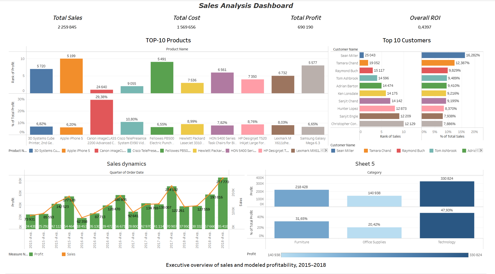

# Sales Analysis Dashboard


## Project Overview

This portfolio project analyzes the sales and profitability performance of a fictional US superstore. The goal is to identify trends across time, product categories, customer segments, and regions and present the results in an interactive Tableau dashboard.


## Project Status

**Status:** Completed

The data preparation, BigQuery validation, Tableau dashboard development, KPI and filter validation, business analysis, and project documentation have been completed.

- Data preparation and BigQuery validation completed
- Tableau KPI values and filters validated
- Dashboard visualizations refined
- Business insights and recommendations completed
- Final portfolio presentation and README completed


## Tools

- **BigQuery** — data loading, cleaning, validation, and feature preparation
- **SQL** — transformations and data-quality checks
- **Tableau Public** — interactive dashboard and visual analysis
- **GitHub** — project documentation and version control


## Dataset

The current processed dataset contains **9,800 rows and 22 columns** and covers orders from **2015-01-03 to 2018-12-30**.

Main groups of fields:

- Orders and shipping
- Customers and segments
- Geography
- Products and categories
- Sales, cost, profit, margin, and ROI


### Source

The original dataset is the **Superstore Sales Dataset** by Rohit Sahoo, downloaded from Kaggle:

https://www.kaggle.com/datasets/rohitsahoo/sales-forecasting


### Profitability Model

The original sales dataset did not contain the current profitability fields. In the processed version, margin rates are assigned by category:

- Office Supplies: 20%
- Furniture: 30%
- Technology: 40%

The derived metrics follow these relationships:

- `Cost = Sales × (1 - Margin)`
- `Profit = Sales - Cost`
- `ROI = Profit / Cost`

Because this is a modeled profitability scenario, the dashboard findings should be described as scenario-based rather than actual company accounting results.


## Data Quality Notes

- Sales, Cost, Profit, Margin, and ROI have no missing values.
- Postal Code contains 11 missing values.
- Order Date and Ship Date use `DD/MM/YYYY` in the CSV.
- There are repeated combinations of Order ID, Customer ID, and Product ID. Most have different sales values, so they should not be removed automatically.
- All current Profit values are positive because profit is generated from positive category-level margin assumptions.


## BigQuery

**Project ID:** `sales-dashboard-project-460219`  
**Dataset:** `sales_profit`  
**Data location:** `US`

Main tables:

- `sales_profit.sales_data_profit` — source table containing 9,800 rows
- `sales_profit.sales_data_profit_clean` — cleaned and validated table created by SQL

The cleaning query was executed successfully in BigQuery.

Validation results:

- Row count: 9,800
- Missing Postal Code values: 11
- Invalid profit calculations: 0
- Sales, cost, and modeled profit totals matched the processed dataset.


## Tableau Dashboard

### Final Dashboard

[Open the Sales Analysis Dashboard in Tableau Public](https://public.tableau.com/views/SalesAnalysisDashboardv2_0/SalesAnalysisDashboard?:language=en-US&:sid=&:redirect=auth&:display_count=n&:origin=viz_share_link)


### Previous Version

[View the previous dashboard version](https://public.tableau.com/views/SalesAnalysisDashboard_17452793623070/SalesAnalysisDashboard?:language=en-US&:sid=&:redirect=auth&:display_count=n&:origin=viz_share_link)


## Dashboard Contents

- KPI cards: Total Sales, Total Cost, Total Profit, and Overall ROI
- Sales and modeled profit trends by quarter
- Top 10 products by modeled profit
- Top 10 customers by sales
- Product and customer contribution within the Top 10
- Modeled profit by product category

## Key Business Insights

- Total sales reached approximately **$2.26M**, with modeled profit of approximately **$0.69M** and an overall modeled ROI of **43.97%**.
- Sales increased from approximately **$479.6K in 2015 to $721.4K in 2018**, despite a temporary decline in 2016.
- Q4 consistently showed strong performance, while Q1 tended to be weaker.
- Technology was the strongest category in the modeled profitability scenario, contributing approximately **47.93% of total modeled profit**.
- The Top-10 products generated approximately **12.15% of total modeled profit**, indicating that profit was distributed across a broad product portfolio.
- The Top-10 customers generated only approximately **6.81% of total sales**, suggesting relatively low customer concentration.


## Business Recommendations

- Prepare inventory, staffing, and promotional activity ahead of strong Q4 demand.
- Prioritize high-performing Technology products while validating actual cost and margin data before making real business decisions.
- Monitor availability and demand for the strongest individual products.
- Maintain a diversified customer strategy rather than relying heavily on a small group of customers.
- Investigate the reasons behind the 2016 decline to identify potential future risks.

## Repository Structure

```text
sales-analysis-dashboard/
├── README.md
├── data/
│   ├── README.md
│   ├── raw/
│   │   └── train.csv
│   └── processed/
│       └── sales_data_with_profit.csv
├── sql/
│   └── 01_clean_sales_data.sql
├── images/
│   └── dashboard-preview.png
└── docs/
    ├── business-questions.md
    ├── business-insights.md
    └── project-status.md
```


## Dashboard Preview




[View the interactive dashboard in Tableau Public](https://public.tableau.com/views/SalesAnalysisDashboardv2_0/SalesAnalysisDashboard?:language=en-US&:sid=&:redirect=auth&:display_count=n&:origin=viz_share_link)
